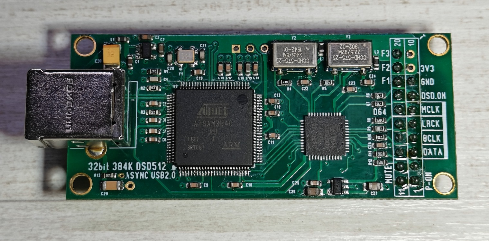
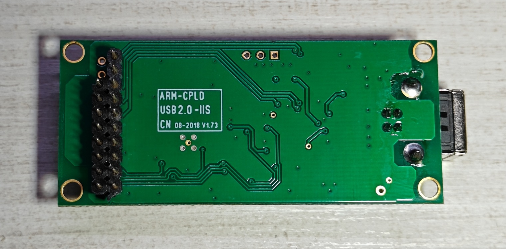
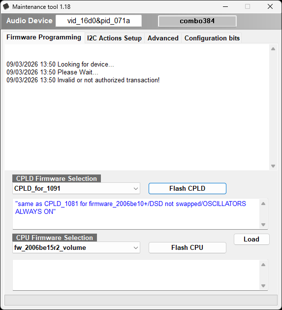
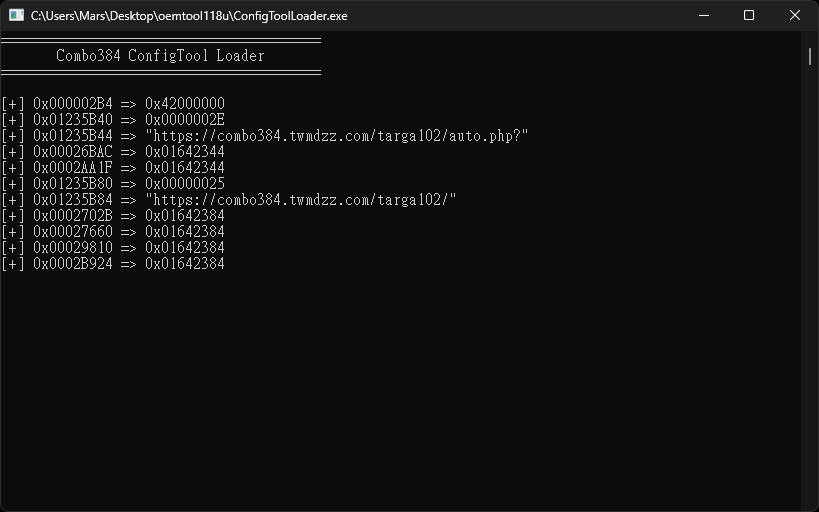
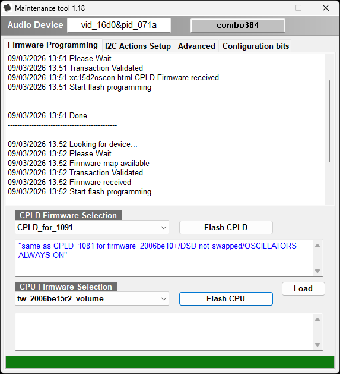

# AmaneroOemToolBypass

## Cloned Board

The official Amanero Combo384 firmware tool is incompatible with cloned Combo384 boards.

Attempting to flash the firmware will display the following message.

> _Invalid or not authorized transaction!_

Then your IP address will be blacklisted by the Amanero server.

## ConfigTool Bypass

After reverse engineering the authorization for **ATMEL Chip ID** and **firmware request**.

I've deployed an API on [Cloudflare Workers](https://combo384.twmdzz.com/) to emulate these requests, The cloned Combo384 card is now completely unlocked!  

Download: [ConfigToolLoader.exe](https://github.com/sabpprook/AmaneroOemToolBypass/releases/latest/download/ConfigToolLoader.exe)

Official tool: [oemtool118u.zip](assets/oemtool118u.zip)

## Best Practice for Combo384

* **Legacy for Windows (Combo384SE)**
    + CPLD_for_1080 + DSD512_8804RTX
    + CPLD_1080_DSDSWAPPED + DSD512_8804RTX
    + CPLD_for_1080 + firmware_1096c4w32_8804
    + CPLD_1080_DSDSWAPPED + firmware_1096c4w32_8804
    * [**Driver 1067**](drivers/setup1067.exe)
    * [**Driver 1068**](drivers/setup1068.exe) (2024 New!)

* **2022 New Firmware**
    + CPLD_for_1091 + firmware_2006be15r2_nodop
    + CPLD_for_1091 + fw_2006be15r2_volume
    * [**UAC2 Driver 11081**](drivers/setupuac2_11081.exe)
    * [**UAC2 Driver 11088**](drivers/setupuac2_11088_hw_volume.exe) (Support volume control)
